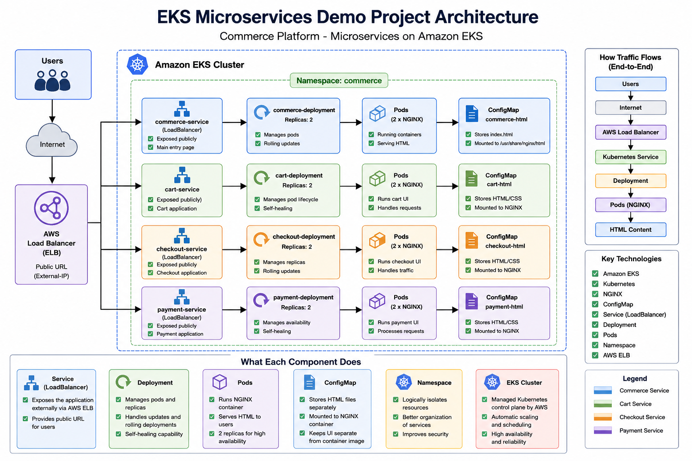

# Kubernetes EKS Microservices Demo Project

## Project Overview

This project demonstrates a complete microservices architecture deployed on Amazon EKS (Elastic Kubernetes Service).

The application simulates a simple e-commerce platform using Kubernetes deployments and services.

The project contains:

- Commerce Service
- Cart Service
- Checkout Service
- Payment Service

Each service runs independently inside Kubernetes pods.

---

# Architecture



```text
Internet
   ↓
AWS Elastic Load Balancer (ELB)
   ↓
Kubernetes Service
   ↓
Deployment
   ↓
Pods
   ↓
NGINX Container
   ↓
Custom HTML Frontend
```

---

# Technologies Used

| Technology | Purpose |
|---|---|
| Kubernetes | Container orchestration |
| Amazon EKS | Managed Kubernetes Cluster |
| kubectl | Kubernetes CLI |
| NGINX | Web server |
| ConfigMap | Store HTML files |
| Deployment | Manage replicas/pods |
| Service | Networking |
| LoadBalancer | Public access |
| AWS ELB | External traffic routing |

---

# Project Structure

```text
microservices-demo/
│
├── commerce/
│   ├── index.html
│   ├── deployment.yml
│   └── service.yml
│
├── cart/
│   ├── index.html
│   ├── deployment.yml
│   └── service.yml
│
├── checkout/
│   ├── index.html
│   ├── deployment.yml
│   └── service.yml
│
├── payment/
│   ├── index.html
│   ├── deployment.yml
│   └── service.yml
│
└── README.md
```

---

# What Each Folder Represents

## Commerce Service

Main application frontend.

Contains:
- Home page
- Navigation links
- Product listing

Publicly exposed using LoadBalancer.

---

## Cart Service

Handles cart-related functionality.

Contains:
- Cart items
- Checkout button

---

## Checkout Service

Handles payment information.

Contains:
- Payment form
- Checkout UI

---

## Payment Service

Handles order confirmation.

Contains:
- Payment success page
- Order confirmation

---

# Kubernetes Concepts Used

## Namespace

Namespace logically separates Kubernetes resources.

Used namespace:
```bash
commerce
```

---

## Pod

Smallest deployable unit in Kubernetes.

Each pod contains:
- NGINX container
- Mounted HTML files

---

## Deployment

Deployment manages:
- Pod creation
- Replica scaling
- Rolling updates
- Self healing

Example:
```yaml
kind: Deployment
```

---

## Service

Service exposes application networking.

Types used:
- ClusterIP
- LoadBalancer

---

## ClusterIP

Internal Kubernetes communication.

Used for:
- cart-service
- checkout-service
- payment-service

Accessible only inside cluster.

---

## LoadBalancer

Creates AWS Elastic Load Balancer.

Used for:
- commerce-service

Provides public URL.

---

## ConfigMap

Stores static HTML files.

Mounted inside NGINX container using:

```yaml
volumeMounts:
```

---

# How Traffic Flows

```text
Browser
   ↓
AWS ELB
   ↓
Kubernetes Service
   ↓
Deployment
   ↓
Pod
   ↓
NGINX Container
   ↓
HTML Page
```

---

# EKS Cluster Creation

## Install kubectl

```bash
curl -LO https://storage.googleapis.com/kubernetes-release/release/$(curl -s https://storage.googleapis.com/kubernetes-release/release/stable.txt)/bin/linux/amd64/kubectl

chmod +x ./kubectl

sudo mv ./kubectl /usr/local/bin/kubectl
```

---

## Install eksctl

```bash
curl --silent --location "https://github.com/weaveworks/eksctl/releases/latest/download/eksctl_$(uname -s)_amd64.tar.gz" | tar xz -C /tmp

sudo mv /tmp/eksctl /usr/local/bin
```

---

## Create EKS Cluster

```bash
eksctl create cluster \
--name demo-cluster \
--region us-east-1 \
--nodegroup-name workers \
--node-type t3.medium \
--nodes 2
```

---

# Verify Cluster

```bash
kubectl get nodes
```

---

# Create Namespace

```bash
kubectl create namespace commerce
```

---

# Deploy Commerce Service

## Create ConfigMap

```bash
kubectl create configmap commerce-html \
--from-file=index.html \
-n commerce
```

---

## Apply Deployment

```bash
kubectl apply -f deployment.yml
```

---

## Apply Service

```bash
kubectl apply -f service.yml
```

---

# Restart Deployment

```bash
kubectl rollout restart deployment commerce-deployment -n commerce
```

---

# Verify Pods

```bash
kubectl get pods -n commerce
```

---

# Verify Services

```bash
kubectl get svc -n commerce
```

---

# Access Application

Open:

```text
http://<EXTERNAL-IP>
```

---

# Expose Internal Services

## Cart

```bash
kubectl expose deployment cart-deployment \
--type=LoadBalancer \
--port=80 \
--target-port=80 \
-n commerce
```

---

## Checkout

```bash
kubectl expose deployment checkout-deployment \
--type=LoadBalancer \
--port=80 \
--target-port=80 \
-n commerce
```

---

## Payment

```bash
kubectl expose deployment payment-deployment \
--type=LoadBalancer \
--port=80 \
--target-port=80 \
-n commerce
```

---

# Useful Kubernetes Commands

## Cluster Info

```bash
kubectl cluster-info
```

---

## Get Nodes

```bash
kubectl get nodes
```

---

## Get Pods

```bash
kubectl get pods -n commerce
```

---

## Get Services

```bash
kubectl get svc -n commerce
```

---

## Get All Resources

```bash
kubectl get all -n commerce
```

---

## Describe Pod

```bash
kubectl describe pod <pod-name> -n commerce
```

---

## View Logs

```bash
kubectl logs <pod-name> -n commerce
```

---

## Restart Deployment

```bash
kubectl rollout restart deployment commerce-deployment -n commerce
```

---

# Real Production Improvements

This project can be enhanced using:

- React frontend
- Node.js backend
- Docker images
- AWS ECR
- Ingress Controller
- HTTPS TLS
- Route53 domain
- Jenkins CI/CD
- GitHub Actions
- Helm Charts
- Prometheus Monitoring
- Grafana Dashboards
- Horizontal Pod Autoscaler

---

# Key Learning Outcomes

After completing this project you understand:

- Kubernetes Architecture
- EKS Cluster Setup
- Deployments
- Pods
- Services
- LoadBalancers
- ConfigMaps
- Namespace Isolation
- Microservices Deployment
- Kubernetes Networking
- AWS Integration

---

# Cleanup

Delete deployments:

```bash
kubectl delete namespace commerce
```

---

# Delete EKS Cluster

```bash
eksctl delete cluster \
--name demo-cluster \
--region us-east-1
```

IMPORTANT:
Delete cluster after practice to avoid AWS charges.

---

# Author

Kubernetes EKS Microservices Demo Project

Built for DevOps and Kubernetes hands-on practice.